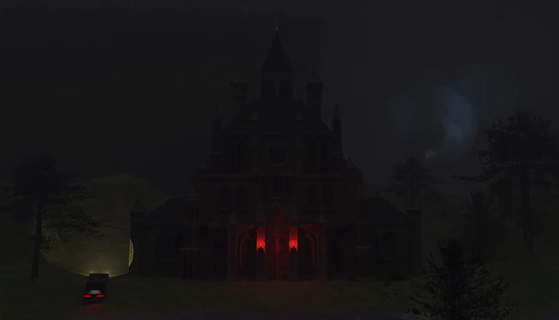

# Venator AR

**Venator AR** is an augmented reality experience where the player explores the Venator world before VR-version launch.
Using AR markers, players can access different interactive experiences such as driving, viewing 3D models, watching a trailer, and playing a vampire survival minigame.



>  This repository contains the **Augmented Reality (AR)** version of **Venator**.  
> The **Virtual Reality (VR)** version is developed in a separate repository.

## Game Overview

The AR experience focuses on exploration and interactivity through image markers.  
By scanning these markers, players can unlock different parts of the Venator universe — from viewing 3D models to playing a mini survival challenge.

> Inspired by **PSX-era visuals**, the project combines a dark gothic atmosphere with interactive AR gameplay.

## Project Structure

All gameplay happens inside the **Main Scene**.  
Even though the project includes several “pseudo-scenes” (menu, instructions, trailer, minigame...), they are all part of the same AR environment, activated through **Image Targets**.

```
├─ _ARScenes/
│   ├─ MenuModule/
│   ├─ InstructionsModule/
│   ├─ TrailerModule/
│   ├─ MinigameModule/
│   └─ ModelViewerModule/
````

Each “module” acts as a virtual scene controlled by a central **SceneManager**, which activates and deactivates them based on the marker detected.

## Technology Stack

| Component | Description |
|------------|--------------|
| **Unity Version** | 6000.0.60f1 |
| **Vuforia Engine** | 11.4.4 |
| **Scripting Language** | C# |
| **Platform** | Android (APK build) |

The AR functionality is powered by **Vuforia Engine**, which handles:
- The **ARCamera** setup.
- **Image Targets** used as markers to display each module (menu, instructions, trailer, etc.).
- Scene control through target detection events.

## Setup Instructions

1. Clone the repository:
   ```bash
   git clone https://github.com/YourUser/Venator-AR.git
   ```

2. Open the project with **Unity 6000.0.60f1**.
3. Install **Vuforia Engine 11.4.4** via Unity Package Manager or from [Vuforia Developer Portal](https://developer.vuforia.com/).
4. Make sure Vuforia is **enabled in Project Settings → XR Plug-in Management → Vuforia Engine** and the database is imported.
5. Open the scene:

   ```
   Assets/Scenes/Main.unity
   ```
6. Press Play and point your camera at one of the printed **Image Targets** to start the AR experience.


## How It Works

* The **ARCamera** detects markers (Image Targets).
* Each marker activates a specific module (e.g., Menu, Trailer, Instructions, Minigame).
* All interactions happen within the same scene — modules are shown or hidden dynamically.
* The player navigates between these modules through AR buttons or marker-based interactions.


## AR Scene Modules

| Module           | Description                                                 |
| ---------------- | ----------------------------------------------------------- |
| **Menu**         | Main hub with options to access all other modules.          |
| **Drive**        | Simple vehicle control experience using on-screen joystick. |
| **Minigame**     | Vampire survival mini-event with progressive difficulty.    |
| **Trailer**      | AR 3D video player themed as a gothic castle wall.          |
| **Model Viewer** | View and rotate 3D models (castle, car, vampire, etc.).     |
| **Instructions** | Displays guidance and controls for the app.                 |


## 📜 License

This project is for educational and experimental purposes.
All assets and code belong to the Venator development team.
